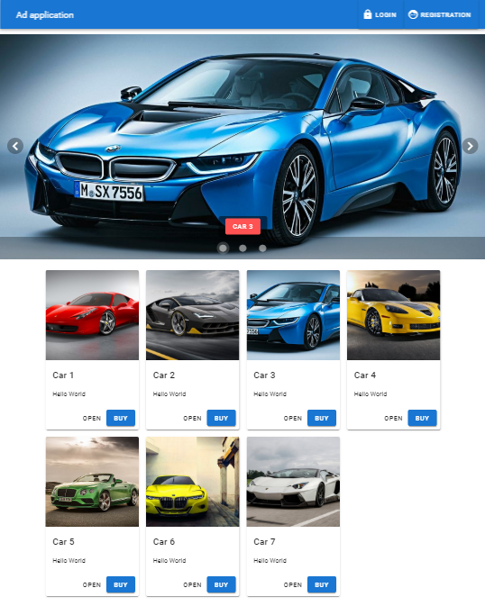

# spa-project
### Practice. Creating a SPA application on VUE, material design and firebase

* Vue
* Vue CLI
* Vue Router
* Vuex
* Vuetify
* Firebase
* Material Design

## Live Demo: [Vue SPA](https://volkovva.github.io/minin-vue/vue-spa/)
### login: test@mail.ru
### password: 123456

## Project Installation

| Script | Destination |
| ------ | ----------- |
| npm install | Setting Dependencies |
| npm run serve | Compiles and hot-reloads for development |
| npm run build | Compiles and minifies for production |
| npm run lint | Lints and fixes files |