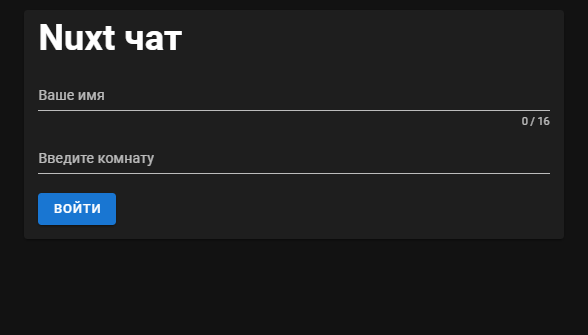
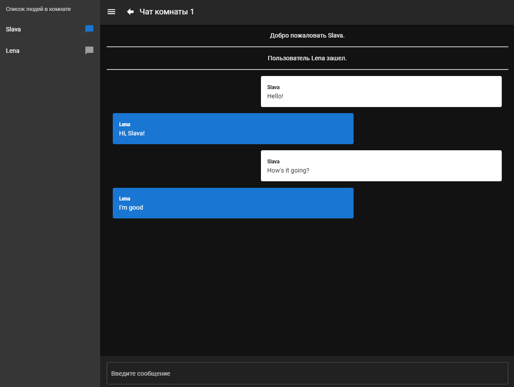

# vue-chat
### Practice. Creating a chat app for correspondence on VUE, Socket.io, Nuxt and Vuetify

* Vue
* Nuxt.js
* Socket.io
* Vuetify
* Material Design

## Project Installation

| Script | Destination |
| ------ | ----------- |
| npm install | Setting Dependencies |
| npm run dev | Serve with hot reload at localhost:3000 |
| npm run build, npm run start | Build for production and launch server |
| npm run generate | Generate static project |