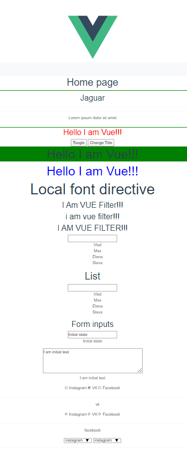

# vue-theory-minin
### Basics of VUE.JS

***Goal***: Learning the basics and features of the VUE.js framework. Practice working with components.

## Live Demo: [Vue Theory](https://volkovva.github.io/minin-vue/vue-theory/)

## Project Installation

| Script | Destination |
| ------ | ----------- |
| npm install | Setting Dependencies |
| npm run serve | Compiles and hot-reloads for development |
| npm run build | Compiles and minifies for production |