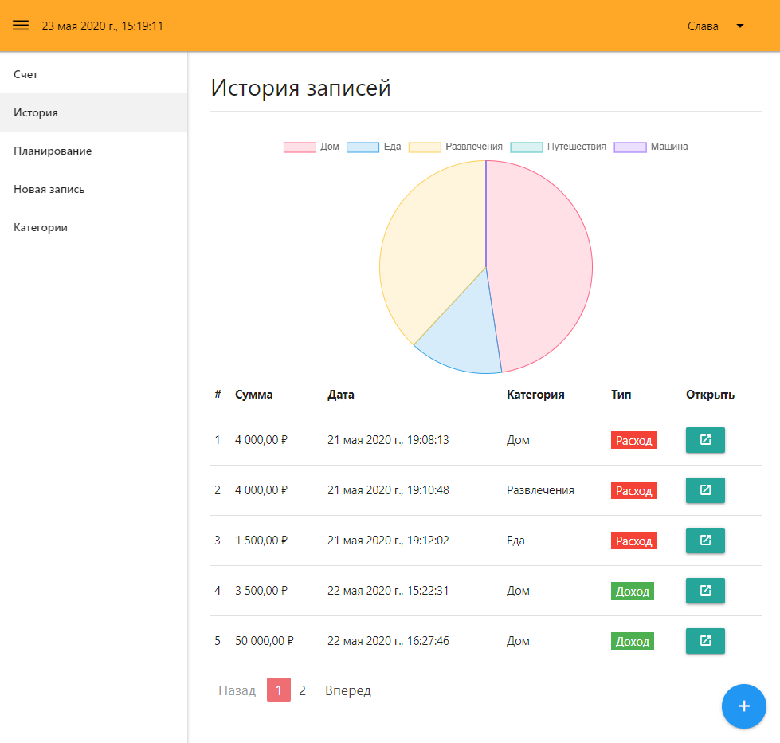
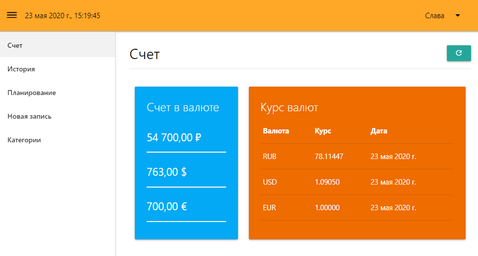

# vue-crm
### Creating a CRM application on VUE and firebase

* Vue
* Vue CLI
* Vue Router
* Vuex
* Firebase
* Vue-chartjs
* Materialize

## Live Demo: [Vue CRM](https://vue-crm-e0c0a.web.app/register)

## Project Installation

| Script | Destination |
| ------ | ----------- |
| npm install | Setting Dependencies |
| npm run serve | Compiles and hot-reloads for development |
| npm run build | Compiles and minifies for production |
| npm run lint | Lints and fixes files |